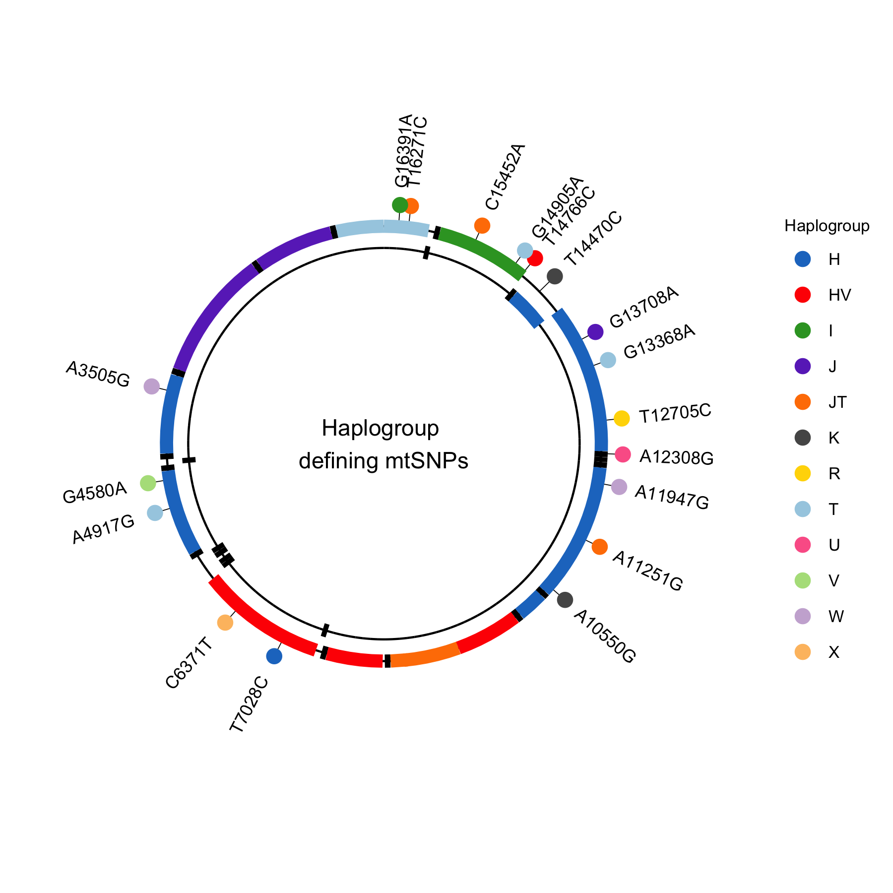

# Plotting Mitochondrial haplogroups defining SNPs

Mitochondrial haplogroups represent sets of similar haplotypes defined by SNVs that arrose as a result of sequential accumulation of mutations during prehistoric human migrations. Here we plot haplogroup defining SNPs on the mitochondrial genome.


_SNPs defining European mitochondiral haplogroups._

## Installation

```
git clone https://github.com/sjfandrews/mtHgs-SNPs-plot.git
```

Dependencies include: `tidyverse`, `ggplot2`, `ggnewscale`, `pals`

```
install.packages('tidyverse', 'ggplot2', 'ggnewscale', 'pals')
```

Haplgroup defining SNPs were obtained from [Hi-MC](https://github.com/vserch/himc) (Smieszek, S. et al. [2018. Peerj](https://doi.org/10.7717/peerj.5149)) and [FamilyTreeDNA](https://www.familytreedna.com/mtDNA-Haplogroup-Mutations.aspx), and are are avaliable in `data/HiMC_mtSNPs.csv` and `scripts/FamilyTreeDNA_mtSNPs.R`. These are not an exhaustive list of all haplogroup defining mtSNPs, but are focused on the major macro haplogroups used by Hi-MC.


Gene boundries for the Mitochondrial geneome were obtained from the [Revised Cambride Reference Sequence](https://www.mitomap.org/MITOMAP/HumanMitoSeq)(rCRS) and are generated by `scripts/mtDNAbdries.R`.

## Usage
Main plotting functions are avaliable in `mtHgSNPs.R`.

---

Code base was inspired by Stephen Turners [Mitochondrial Solar Plot](https://github.com/stephenturner/solarplot) and by the [GWAS Catalog ideogram](https://www.ebi.ac.uk/gwas/diagram).
